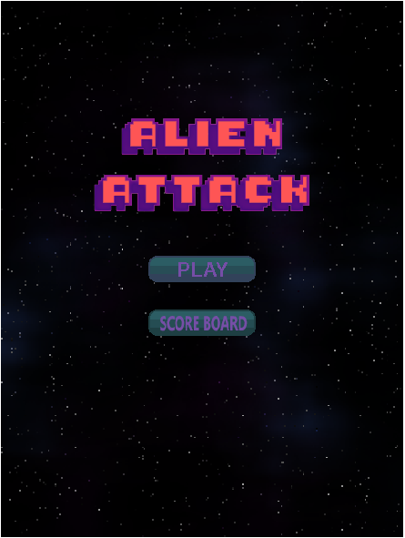
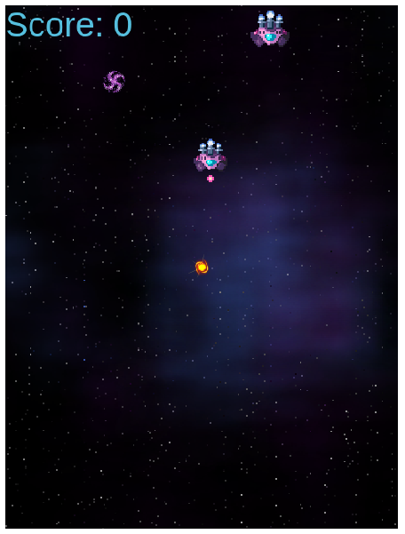
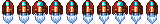

# Alien Attack

> This is a game where you play the role of an interstellar pilot and kill all the aliens avoiding to get hit or crashing with the aliens spaceships.

You can see a video with a demo of the game [Here](https://www.loom.com/share/c3a7d27273db48938ea4d5192e4efabd) 
## Game Design
## Story Overview
In a universe where only one planet remains, just one hero can kill all the atrocities that are in the galaxy and avoid the total extermination of humanity, and that is you,the hero of the galaxy that has to stop the ALIEN ATACK!!.
### Concept

- Play as an interstellar Pilot.
- Destroy all the spaceships to earn more points.
- Avoid crashing with the enemy you have only one live.

### Controls

You need a keyboard to control the Player Ship.

- Press ⬆️ to move up.
- Press :arrow_down: to move down.
- Press ➡️ to go right.
- Press ⬅️ to go left.
- Press <kbd>Space</kbd> to shoot.

### Assets

|Asset                                      |Description                            |
|-------------------------------------------|---------------------------------------|
|  | Player spaceship to destroy all aliens.|
|   |Enemy Purple Killer Alien              |
||World background                       |
| |Enemy Bullet to avoid |
|  |Mini enemy Purple Killer Alien destory to get points  |

## Built With

- Javascript
- Phaser
- Webpack, Babel and Jest

## Live Demo

[Live Demo Link](https://rawcdn.githack.com/kenderb/JS-CAPSTONE/7059cccb1f0496604c53cf174f030729c178dd72/dist/index.html)

## Getting Started

To get a local copy up and running follow these simple example steps.

### Prerequisites

- Node.js
- npm

### Setup

Run `git clone https://github.com/kenderb/JS-CAPSTONE.git` in your terminal to clone this repo.

### Install

Install the necesarry dependencies by running `npm install` in the root of cloned repo.

### Usage

Run `npm start` to view the game in your default browser.

### Testing

Run `npm test` to run the tests.

## Authors

👤 **Kender Bolivar**

- GitHub: [@kenderb](https://github.com/ken)
- Twitter: [@KBTarts](https://twitter.com/KBTarts )
- LinkedIn: [KenderBolivar](https://www.linkedin.com/in/kender-bolivar-1736086b/ )

## 🤝 Contributing

Contributions, issues, and feature requests are welcome!

## Show your support

Give a ⭐️ if you like this project!

## Acknowledgments
- Stack Overflow
- [OpenGameArt](https://opengameart.org/)

## 📝 License

This project is [MIT](./LICENSE) licensed.
