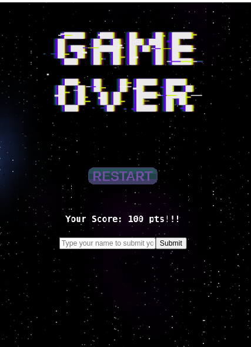
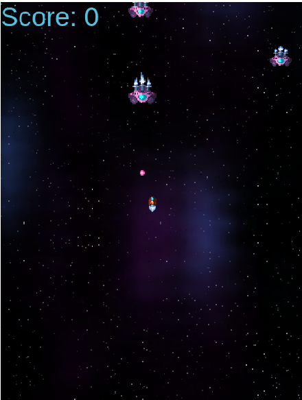
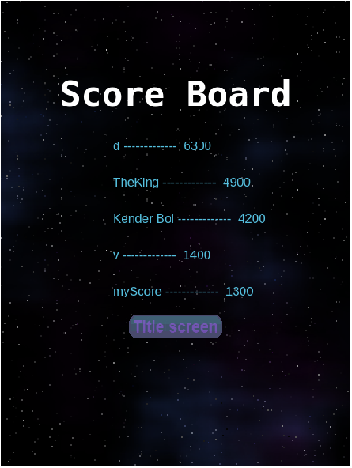

# Alien Attack

> This is a game where you play the role of a interestellar pilot and kill all the aliens avoiding to get hit or crashing with the Alien spaceships.

## Game Design

### Concept

- Play as a interstellar Pilot.
- Destroid all the spaceships to earn more points.
- Avoid craching with the enemy you have only one live.

### Controls

You need a keyboard to control the panda.

- Press ⬆️ to move up.
- Press ➡️ to go right.
- Press ⬅️ to go left.

### Assets

|Asset                                      |Description                            |
|-------------------------------------------|---------------------------------------|
|  |Panda spritesheet to animate the player|
|   |Enemy Purple Killer Alien              |
||World background                       |
| |Enemy Bullet to avoid |
|  |Mini enemy Purple Killer Alien destory to get points  |

## Built With

- Javascript
- Phaser
- Webpack, Babel and Jest

## Live Demo

[Live Demo Link]()

## Getting Started

To get a local copy up and running follow these simple example steps.

### Prerequisites

- Node.js
- npm

### Setup

Run `git clone ` in your terminal to clone this repo.

### Install

Install the necesarry dependencies by running `npm install` in the root of cloned repo.

### Usage

Run `npm start` to view the game in your default browser.

### Testing

Run `npm test` to run the tests.

## Authors

👤 **Kender Bolivar**

- Github: [@kenderb]()
- Twitter: [@kenderb]()
- Linkedin: [kenderb]()

## 🤝 Contributing

Contributions, issues, and feature requests are welcome!

## Show your support

Give a ⭐️ if you like this project!

## Acknowledgments

- [OpenGameArt](https://opengameart.org/)

## 📝 License

This project is [MIT](./LICENSE) licensed.